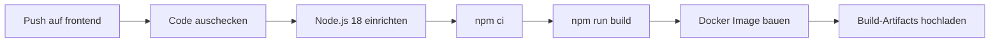
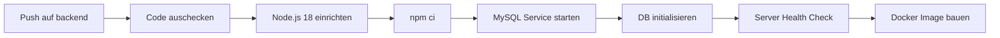

# Oase Spa Wien – Full-Stack Webanwendung

Wellness-Buchungsplattform mit Vue.js Frontend und Node.js/Express Backend.

## Projektstruktur

Das Projekt ist in **zwei separate Branches** aufgeteilt:

| Branch | Beschreibung | Technologien |
|--------|-------------|--------------|
| `frontend` | Vue.js SPA mit Vite | Vue 3, Vite, Bootstrap, Pinia |
| `backend` | REST API Server | Node.js, Express, MySQL, MongoDB |

---

## CI/CD Pipeline

### Überblick

```
Developer pusht Code → GitHub Actions → Build & Test → Docker Image → Deployment
```

Bei jedem Push auf den jeweiligen Branch wird automatisch eine CI/CD-Pipeline ausgeführt:

### Frontend Pipeline (`frontend-ci.yml`)



**Schritte:**
1. **Code auschecken** – Repository klonen
2. **Node.js einrichten** – Version 18 mit npm Cache
3. **Dependencies installieren** – `npm ci` für reproduzierbare Builds
4. **Build ausführen** – `npm run build` (Vite Production Build)
5. **Docker Image bauen** – Multi-Stage Build (Node → Nginx)
6. **Artifacts hochladen** – `dist/` Ordner als Build-Artifact

### Backend Pipeline (`backend-ci.yml`)



**Schritte:**
1. **Code auschecken** – Repository klonen
2. **Node.js einrichten** – Version 18 mit npm Cache
3. **Dependencies installieren** – `npm ci`
4. **MySQL Service** – MySQL 8.0 Container wird als Service gestartet
5. **Datenbank initialisieren** – `db/db.sql` wird eingespielt
6. **Health Check** – Server wird gestartet, API-Endpunkt wird geprüft
7. **Docker Image bauen** – Node.js 18 Alpine Image

---

## Docker

### Frontend (Multi-Stage Build)

```bash
# Image bauen
cd vue-template
docker build -t oase-spa-frontend .

# Container starten
docker run -p 8080:80 oase-spa-frontend
```

Das Frontend nutzt einen **Multi-Stage Build**:
- **Stage 1**: Node.js 18 baut die Vue.js App (`npm run build`)
- **Stage 2**: Nginx Alpine serviert die statischen Dateien

### Backend

```bash
# Image bauen
docker build -t oase-spa-backend .

# Container starten (mit MySQL-Verbindung)
docker run -p 5000:5000 \
  -e DB_HOST=host.docker.internal \
  -e DB_USER=root \
  -e DB_PASSWORD=root \
  -e DB_NAME=db \
  oase-spa-backend
```

**Umgebungsvariablen:**

| Variable | Beschreibung | Default |
|----------|-------------|---------|
| `DB_HOST` | MySQL Host | `localhost` |
| `DB_USER` | MySQL User | `root` |
| `DB_PASSWORD` | MySQL Passwort | `root` |
| `DB_NAME` | Datenbank Name | `db` |
| `PORT` | Server Port | `5000` |
| `MONGODB_URI` | MongoDB URI (optional) | `mongodb://localhost:27017/spa-bookings` |

---

## Deployment

### Frontend → Vercel

Das Frontend wird über **Vercel** deployed:
- Automatisches Deployment bei Push auf `frontend`
- Vercel erkennt Vue.js/Vite automatisch
- Kein Docker für Vercel-Deployment nötig

### Backend → Render (Docker)

Das Backend kann über **Render** als Docker-Container deployed werden:
- Render nutzt das `Dockerfile` im Repository
- MySQL muss als externer Service bereitgestellt werden

---

## Lokale Entwicklung

### Frontend
```bash
git checkout frontend
cd vue-template
npm install
npm run dev          # → http://localhost:5173
```

### Backend
```bash
git checkout backend
npm install
mysql -u root -p < db/db.sql    # Datenbank einrichten
npm run dev                      # → http://localhost:5000
```

---

## Technologie-Stack

| Komponente | Technologie |
|-----------|-------------|
| Frontend | Vue.js 3, Vite, Bootstrap 5, Pinia |
| Backend | Node.js, Express, MySQL2, Mongoose |
| Container | Docker (Multi-Stage) |
| CI/CD | GitHub Actions |
| Deployment | Vercel (Frontend), Render (Backend) |
